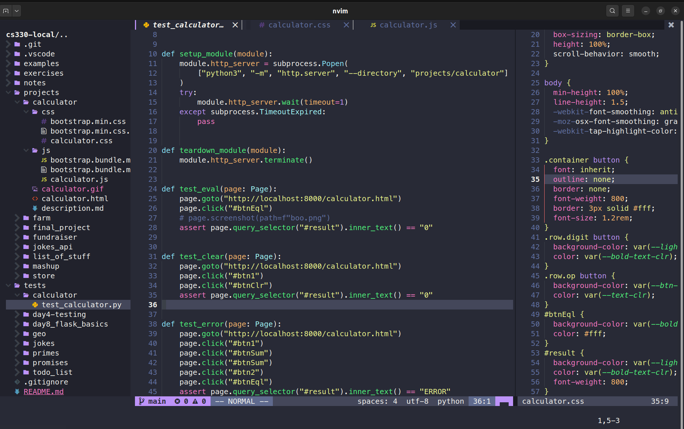

# Neovim from scratch - modified from chris@machine's version

**Update** This repo should work fine with Neovim 0.8, also all packages are pinned so it should remain stable.

<br>

**Update** I added windows.nvim plugin, which automatically expands width of the current window; maximizes and restores the current window; and has all this with nice animations as well!

https://user-images.githubusercontent.com/13056013/190786962-01047891-38b1-4e87-bd9b-e8eca9acc8b8.mp4

**Dracula theme**


## Try out this config

Make sure to remove or move your current `nvim` directory

**IMPORTANT** Requires [Neovim v0.8.0]](https://github.com/neovim/neovim/releases).  [Upgrade](#upgrade-to-latest-release) if you're on an earlier version. 
```
git clone https://github.com/Hudson-Pufferfish/neovim-config-with-dracula-theme.git ~/.config/nvim
```

Run `nvim` and wait for the plugins to be installed 

**NOTE** (You will notice treesitter pulling in a bunch of parsers the next time you open Neovim) 

## Get healthy

Open `nvim` and enter the following:

```
:checkhealth
```

You'll probably notice you don't have support for copy/paste also that python and node haven't been setup

So let's fix that

First we'll fix copy/paste

- On mac `pbcopy` should be builtin

- On Ubuntu

  ```
  sudo apt install xsel
  ```

- On Arch Linux

  ```
  sudo pacman -S xsel
  ```

Next we need to install python support (node is optional)

- Neovim python support

  ```
  pip install pynvim
  ```

- Neovim node support

  ```
  npm i -g neovim
  ```
---

**NOTE** make sure you have [node](https://nodejs.org/en/) installed, I recommend a node manager like [fnm](https://github.com/Schniz/fnm).

### Upgrade to latest release

Assuming you [built from source](https://github.com/neovim/neovim/wiki/Building-Neovim#quick-start), `cd` into the folder where you cloned `neovim` and run the following commands. 
```
git pull
make distclean && make CMAKE_BUILD_TYPE=Release
sudo make install
nvim -v
```

> The computing scientist's main challenge is not to get confused by the complexities of his own making. 

\- Edsger W. Dijkstra
